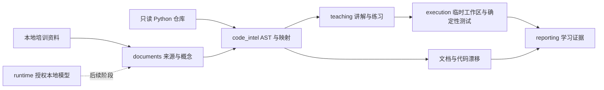

# 架构与接口边界

| 模块 | 输入 | 输出 | 负责人 |
| --- | --- | --- | --- |
| documents | 本地文件、学习目标 | Concept | Documents / Model |
| code_intel | Concept、仓库快照 | CodeMapping、DriftFinding | Code Intelligence |
| teaching | 已核验映射 | LearningArtifact 路径与内容 | Teaching / Evaluation |
| execution | 已审核命令、隔离工作区 | 退出码、预期结果、测试证据 | Code Intelligence |
| runtime | 显式本地端点配置 | 本地模型适配 | Documents / Model |
| reporting | 前述结构和执行证据 | 六类最终产物 | Teaching / Evaluation |
| cli / contracts | 命令与 JSON Schema | 阶段编排、数据校验 | Lead |

Phase 0 的逻辑在 `scaffold.py`：读取一个预定义 Concept，用标准库 AST 查找固定函数
与测试，在临时目录执行合成示例和 pytest，再写三份报告。其他包仅保留导入边界。
`contracts.py` 以唯一运行时依赖 jsonschema 实际验证 Draft 2020-12，其他逻辑优先标准库。

Fixture 临时副本不是操作系统沙箱。后续任意仓库执行必须单独设计权限、命令审核、
资源和网络限制。CLI 当前不接收任意目标代码或文档路径。
