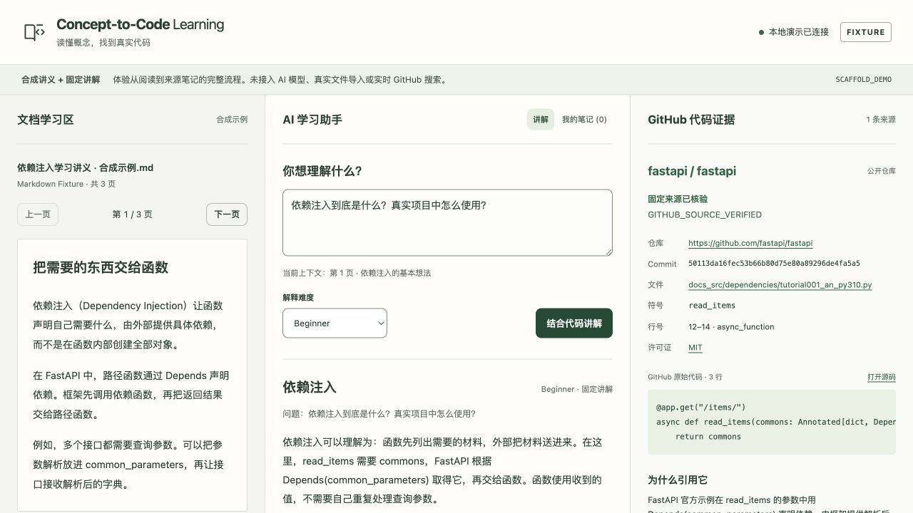

# Lead 统一审核材料 · PARTIAL

1. **现在能做什么：** 运行清楚标注的Fixture网页；新版中央服务已经实现文档/来源/教学接缝、服务器核对、会话与来源笔记；四份完整模块任务书和Issues已发布，Skill可实际调用本机API。
2. **还不能做什么：** 三个完整成员模块尚未交付，当前不能真实导入四格式并调用真实来源/模型完成学习；原生Windows、DGX与真实Skill教学收益未验证。不是完整产品Live通过。
3. **怎样一条命令启动：** 完成一次依赖安装/前端构建后，在repo根目录运行 `python scripts/start.py`。已有此工作区venv用 `.venv/bin/python scripts/start.py`。详见 [启动与配置](../../full-delivery/RUNNING.md)。
4. **用户现在看哪几处：** [PR #69](https://github.com/suiyisuixing/concept-to-code-learning/pull/69)、[功能矩阵](FUNCTION_MATRIX.md)、[实际验证](VALIDATION.md)和[五分钟检查](HANDOFF.md)。检查实际界面和关键代码后由用户统一决定，人工审核仍PENDING。

## 状态分开报告

| 维度 | 当前结论 |
|---|---|
| implementation | PARTIAL：Lead独立实现可审；三成员完整模块与最终装配待其交付 |
| module_tests | PASS：264 Python（含56新版cases）+5前端；旧回归全保留 |
| live_external_check | BLOCKED：真实文档/来源/模型链未运行；本轮没有未授权GitHub内容检索或云模型调用 |
| integrated_product | PARTIAL / UNAVAILABLE：现有UI是Fixture，新capabilities如实报告三个模块不可用 |
| target_hardware | NOT_TESTED：Mac本地启动已观测；原生Windows和DGX未观测 |
| lead_review | PENDING：未声称用户人工检查、批准或合并 |

## 交付身份与依赖PR

仓库仍私有。main `369acd673d2ae0d1ae3bc8f591a2c7e51e4dc459`；`BASELINE_KIND=UNMERGED_CONTRACT`。分支 `feat/full-learning-integration`；运行代码Head `53dc7bb187307cd84cc2c9f92903e0e959986361`。后续文档/截图提交仅补审核证据；当前PR最终Head与CI在PR正文和封存记录里核对。

| PR | 作者 | 本次核对Head | 与候选关系、CI和建议 |
|---|---|---|---|
| #58 | suiyisuixing | 60d4a5cd8ebbf50341219940f762993975a4781d | 未合并；作为旧合同祖先完整保留；该Head phase0-checks成功。可审核合同兼容性，不能当作真实模块完成 |
| #60 | fqf060420 | 4a9b4548f66ae589860a49a9d6481822f35b0c0e | 未合并；UTF-8修复原提交保留；该Head CI成功，组合回归通过。可按编码补丁范围评审，不算Tutor交付 |
| #62 | fqf060420 | 4689f0ff74aa331e96f6bab3dbca1b8de85a5b72 | 未合并；SQLite显式关闭保留；该Head CI成功，raw connect与Sprint1调用已组合检查。可按句柄修复范围评审，原生Windows单列 |
| #59 | zchzbjklg | e5b7f16dfb3ebc24d8af1fa1a00ea75711e5b7d9 | 未合并；入队文档原提交保留；该Head CI成功。只接受为协作记录，不能算来源模块完成 |
| #64 | suiyisuixing | 3374aa2955729bd953480729a9632ce7d167567d | 已由用户合入main；该Head CI成功；本轮直接继承，不重复合并 |
| #69 | suiyisuixing | 实现Head见上；最终发布Head见PR正文 | 新完整Lead候选，保持草稿/未合并；独立范围可审，Codex建议revise（开发依赖告警待修订）；完整产品证据仍待补齐 |

三个完整模块入口为 [#66](https://github.com/suiyisuixing/concept-to-code-learning/issues/66)、[#67](https://github.com/suiyisuixing/concept-to-code-learning/issues/67)、[#68](https://github.com/suiyisuixing/concept-to-code-learning/issues/68)。截至本次核对，尚无对应新模块PR。实际Git祖先保留各作者；未对main、旧tag、历史Issue、权限/保护/CI进行本轮修改。

## 实现要点与实际边界

共享合同新增命名空间，Pydantic→JSON Schema/OpenAPI同源生成；旧additionalProperties=false与PPTX枚举保留。DocumentProvider负责真实文件，SourceProvider负责真实字节/静态核验，TutorProvider负责模型/教学，Lead负责整体编排与交易一致性。固定工厂不存在时直接UNAVAILABLE，生产路径不自动注册替身。

选区按服务端块和code-point区间重新读取；切页CAS/请求epoch拒绝迟到写入。来源从session/query/scope/hash注册表取，浏览器不能自发VerifiedSource；本地授权在核验/复用时重查。plan不能扩大来源授权，公开查询逐项使用批准必要词。引用原码不可改写后仍标SOURCE_EXACT，模型自造URL/未核验符号/虚构执行被拒绝；这些是结构边界，不是教学正确性证明。

笔记仅显式保存、相同请求幂等、事务内冻结document/explanation/source，用户文字修订与引用分离；删除需确认并保留防复活幂等墓碑。导出离线读取原快照。新数据库独立；原NoteStore与Sprint1的raw connection返回和显式closing保持兼容。

细节与证据：[FUNCTION_MATRIX](FUNCTION_MATRIX.md)、[SKILL_EVALUATION](SKILL_EVALUATION.md)、[DEPENDENCIES](DEPENDENCIES.md)、[HANDOFF](HANDOFF.md)。截图只包含合成演示资料：

## 风险、审核与回滚

这是共享运行时、公开合同和持久状态的较大候选，不能因测试绿色自动合并。Codex差异风险审核绑定实现提交和最终报告提交；评估产物独立封存，建议revise：先处理现有Vitest开发依赖告警；成员真实链与最终人工决定仍须补齐。生产factory是受信任的已审核模块，参数最小化不等于同进程安全沙箱；真实模型间接指令防护/来源语义需要fqf和zch的实际评测。

开发依赖存在同一Vitest公告的2项moderate；生产依赖audit为0。公告前置条件与当前构建/测试配置的关系见DEPENDENCIES，不运行强制升级。Python原生扩展/依赖锁在Mac验证，Windows/Linux/DGX分别按现场证据报告。

回滚无需迁移旧笔记：保持main未变即可继续旧软件。若用户后来合入候选，应通过正常revert PR恢复代码，并先停止服务、备份新旧data目录及笔记导出；新库保留供恢复，不能将其删除当作回滚。无自动云回退、自动模型下载、付费服务、Tag移动或强制推送。

下一步固定为接收完整模块并装配补证，见[CONTINUATION](CONTINUATION.md)。当前没有待用户逐小步安排的拆分任务；用户最终人工审核和合并决定始终保持未勾选。
