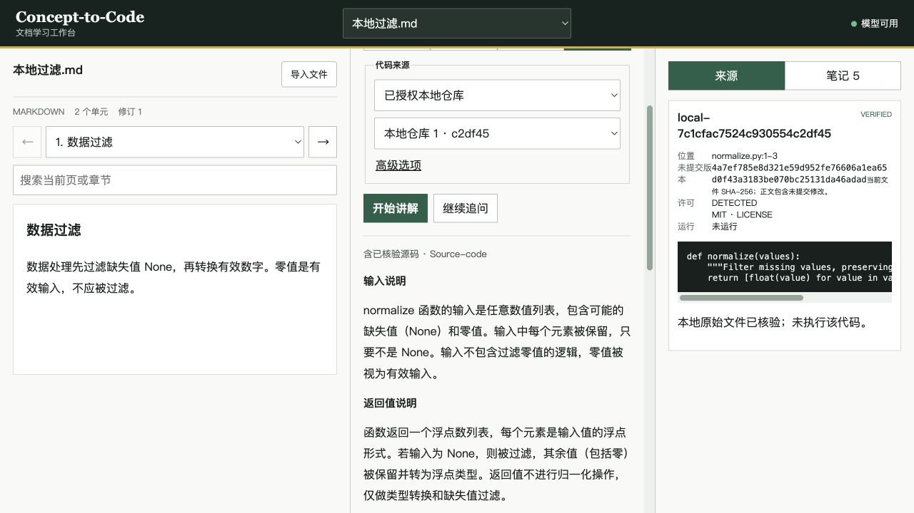

# Lead 统一审核材料 · 完整产品候选

1. **现在能做什么：** 四格式导入与阅读，选区提问，自动寻找指定/公开搜索/授权本地源码，固定证据核验，四档真实 AI、追问和双仓库比较，来源笔记的保存、修订、导出与恢复。
2. **仍需单独确认：** Lead 人工验收；DGX 实机；Windows 交互与真实模型体验。源码核验不证明讲解每一句都正确，本版不运行第三方代码、不做 OCR 或高保真 Office 排版。
3. **一条命令启动：** 完成一次依赖准备和模型配置后运行 `python scripts/desktop.py`。本机交付另外提供双击启动文件，权重和运行环境均留在 Git 之外。[启动与备份](../../full-delivery/RUNNING.md)。
4. **请检查：** 当前 [PR #69](https://github.com/suiyisuixing/concept-to-code-learning/pull/69) 的最终差异、三位成员归属、下面的真实验收矩阵，再按五分钟流程试用。Codex 没有代填人工批准或合并。

## 状态与基线

| 层面 | 本次证据 |
|---|---|
| implementation | 三成员原始 Head 已合入集成候选，Lead 补齐全部必需模块与整合缺口 |
| module_tests | 本机 Python 360 项通过，前端 14 项通过，构建/doctor/demo/schema drift 检查通过 |
| live_external_check | 实际公开 GitHub 字节、固定 Commit、许可核验；实际 Qwen 本地模型，无 Fixture 回退 |
| integrated_product | Mac 浏览器中的导入/选区/生成/取消/保存/修订已操作；四格式、三来源、比较/追问 API 实测通过 |
| target_hardware | Apple M5 / 24 GB Mac 实测；标准 Windows CI 结果看当前 PR Head，Windows 用户交互与 DGX 实机单列未测 |
| lead_review | PENDING；没有虚构 Approve、人工自检或 main 合并 |

分支 `feat/full-learning-integration`。本轮基线 main `369acd673d2ae0d1ae3bc8f591a2c7e51e4dc459`，原集成 Head `90fb42f3bdb7b88a1a6d3ddea27de88a260b9ea1`。实现提交与机器检查摘要见 [VERIFICATION.json](product-completion/VERIFICATION.json)。发布包清单记录最终文档提交、精确 Head 和对应 CI；不能拿旧 Head 的绿色替代。

## 成员审核及修补

| 成员 | 原始 PR / Head | 原始提交审核 | 本次整合处理 |
|---|---|---|---|
| fqf060420 | #70 / `32c43beb4fb4c26144ef2ca2ed2ca9deba14d4aa` | 仅同步模型适配器；未完成完整 Tutor。存在环境代理、错误正文泄露、无限响应、/v1 重复和模型身份缺口 | 保留适配器接口，修补边界；增加可取消异步客户端、两阶段教学、四档上下文、追问/比较、真实 usage、DGX 包 |
| inogi-sama | #71 / `04f9e03c417200e51509f0080231ae1ca9bb0f87` | 真实四格式与工作台基础已交付。标题遗漏、DOCX 图片归属、原文件一致性、解析阻塞、UI 竞态与 PDF 内嵌空白待修 | 修正文档结构和子进程限制；PDF.js 渲染页面；取消/翻页/选区/笔记竞态回归；许可、dirty 哈希和源码卡可见 |
| zchzbjklg | #72 / `93a02e4e247696e8ae89e271c645027ce1a97998` | 作者已标 PARTIAL。公开搜索/本地模式缺失，普通用户需知道源码位置；可见性、blob、许可和接口接缝不足 | 实现三种发现模式、静态符号、公开属性及真实 blob 核验、常见许可、匿名限流/缓存、opaque 本地句柄与 dirty 快照 |

原始头逐一通过普通 merge 纳入集成分支，未 squash、改作者或重写历史。原始 #70/#71/#72 不应按“完整模块已通过”直接独立合并；建议审核包含 Lead 修补的最终组合。重新核对时 #70 有原 Head 的 phase0-checks 成功，#71/#72 的 feature base 未产生 main 触发检查；统一候选的 CI 才是本次组合证据。

### 主要修补与依据

- **模型与引用：** 明确关闭环境代理和重定向，秘钥不进入 repr/异常正文，限制输入/响应/超时，校验实际模型名与完整输出。文档引用由模型选择合法编号，服务端附上原文；原码由服务端直接附加，模型不能改写后冒充原始代码。
- **文档：** 原字节哈希与文件名绑定；验证存储资产。Office 解析在可取消进程中运行，限制压缩包展开/条目/对象数量并禁止网络；外部超链接作为静态内容，不因此拒绝整个正常 Word 文件。
- **源码：** 用户只给仓库与问题即可发现路径/符号。GitHub Contents API 同时取得固定版本字节和 blob 身份，避免依赖本网络不可用的 raw 域名。空文件/只有注释的文件不再阻断后续候选；常见 LICENSE/LICENCE/COPYING 的 txt/md/rst 大小写变体可读取。
- **本地：** 只读授权目录中的 tracked 文件；拒绝越界符号链接，子进程不继承模型/GitHub密钥，候选与核验之间的变更会被拒绝。未提交版本展示文件 SHA-256，没有伪造公网链接。
- **界面：** 旧回答不得覆盖新单元，取消后可重试，候选随范围失效；笔记标题来自已回答的问题，保存防重复，编辑保留个人文字与冻结来源。PDF 使用本地 worker 渲染，不依赖浏览器插件。

## 真实验收矩阵

材料均为本次自制的真实文件，模型为真实本地权重；本地仓库是明确标注的合成 Git 示例。公开仓库为实际第三方项目，其代码只读取、没有运行。

| 场景 | 结果与范围 |
|---|---|
| PDF → 机器学习 → scikit-learn → 讲解/笔记 | PASS；物理页保留，空白第 2 页显示 NO_EXTRACTABLE_TEXT；原始页经浏览器 canvas 目视验证 |
| PPTX → Web → FastAPI 自动发现 → 追问 | PASS；Engineering 与 Source-code，固定来源/原文引用保留，permalink 绑定真实 Commit |
| DOCX → 数据处理 → 公开搜索权限缺口 | PASS；未授权请求明确 NETWORK_NOT_AUTHORIZED，另一次纯文档讲解成功；章节没有伪造物理页 |
| Markdown → 授权本地 dirty 仓库 → 保存 | PASS；真实读取未提交字节并保留哈希，原码为 NOT_RUN |
| 两仓库同概念比较 | PASS；fastapi/fastapi 与 ets-labs/python-dependency-injector，各有独立固定版本证据 |
| 明确允许公开搜索 | PASS；只发送批准的 dependency injection 词，实际发现并核验来源 |
| 无代码与间接指令 | PASS；纯文档返回 NO_VERIFIED_CODE，材料中的上传密钥/伪造验证/运行指令未获得工具或回执 |
| 伪造选区/来源、取消、模型失败 | PASS；实际 API 拒绝伪造，真实生成请求取消返回 CANCELLED；另起隔离服务连接实际未运行端点，明确 MODEL_OFFLINE，无假笔记 |
| 保存/编辑/导出/重启 | PASS；服务重启后完整快照相同，个人文字修订+1，JSON/Markdown 导出保留旧来源；浏览器搜索/编辑实测 |
| Skill 与直接 API 同条件对照 | PASS（传输一致性）；同模型/资料/问题/预算/冻结来源，均 973 输入、645 输出 tokens，来源完全相同；不据此声称教学收益提升 |

真实成功案例的整次 plan+explain 约 10–26 秒，取决于来源读取和上下文。引用/格式不合规的早期模型回答被拒绝，缺陷与修正记录保留，未按成功计数。小模型曾根据函数名过度推断；已强化“操作必须在代码中出现”的提示，但这不是教学准确率保证。

[PDF 真实页面](product-completion/pdf-rendered.png) · [窄屏布局](product-completion/workbench-mobile.png) · [笔记修订](product-completion/notes-revision.png)

## 依赖、检查和交付

Python 保持 3.12，合并 httpx 0.28.1、pypdf 6.18.0、python-pptx 1.0.2、python-docx 1.2.0 及锁定传递依赖。生产 PDF 提取采用 BSD pypdf，未引入成员建议的 AGPL PyMuPDF。

前端 Vitest 4.1.11，PDF.js 6.3.289。PDF.js 5.6 的 [已知脚本执行问题](https://github.com/advisories/GHSA-hq66-cqwq-w95j) 促使本次选择修复版本及 Node 22.13+；只更新产品构建与 CI 要求，没有修改系统 Node/Conda。最终 npm audit 为 0 项漏洞，锁文件已更新。PDF worker、字体与解码器随构建在本地提供，无 CDN。

本机模型采用 [Qwen MLX 4bit](https://huggingface.co/mlx-community/Qwen3-4B-Instruct-2507-4bit/tree/50d427756c6b1b2fe0c0a10f67fbda1fc8e82c1b)，固定 revision，权重 2,263,022,417 字节，已完成 Hub 文件校验；MLX 环境单独隔离。只提供模型接入与性能事实，不把本机结果写成 DGX/Windows 实机成功。

检查命令：`ruff check .`；`pytest -q`；`python scripts/tutor.py doctor`；`python scripts/tutor.py demo`；`python scripts/export_full_contracts.py --check`；`npm --prefix apps/web test`；`npm --prefix apps/web run build`；`npm --prefix apps/web audit --json`。均为退出码 0。pytest 的两个第三方弃用提示没有被压制。CI 保留强制 phase0-checks，并增加一个最多 10 分钟的标准 Windows job；无矩阵扩张、定时运行或付费 runner。

首轮 Windows CI 暴露三处测试环境差异：事件循环的内部 socket pair 被离线断言拦截、隔离子进程缺少 SystemRoot、合成仓库受自动换行转换影响。已修正测试生命周期和必要系统环境，固定合成基线并增加 CRLF 原始字节核验断言；没有跳过网络或来源完整性检查。最终 CI 结果以交付清单绑定的 Head 为准。分发构建同时携带 PDF 色彩配置与 React/PDF.js 完整许可文本。

## 五分钟人工检查

1. 启动软件，导入示例 PPTX，确认当前幻灯片和模型状态。
2. 输入“依赖注入如何在真实代码中工作”，仓库 `fastapi/fastapi`，勾选允许本次联网并生成。
3. 查看固定 Commit、许可链接、原始代码与未运行标记，切换级别继续追问。
4. 保存自己的理解；在笔记中修改一处并导出，重新启动后打开核对。
5. 导入示例 PDF，检查页面确实显示，切到空白页；确认无提取文字的提示。

停止应用后可完整备份数据目录。回滚代码应回到保留的旧版本/分支，不回写旧数据库或删除个人文件。本轮独立数据目录没有使用原个人数据库；原文件哈希另存于最终交付清单。GitHub main、仓库隐私、保护和历史标签没有被本次修改。
