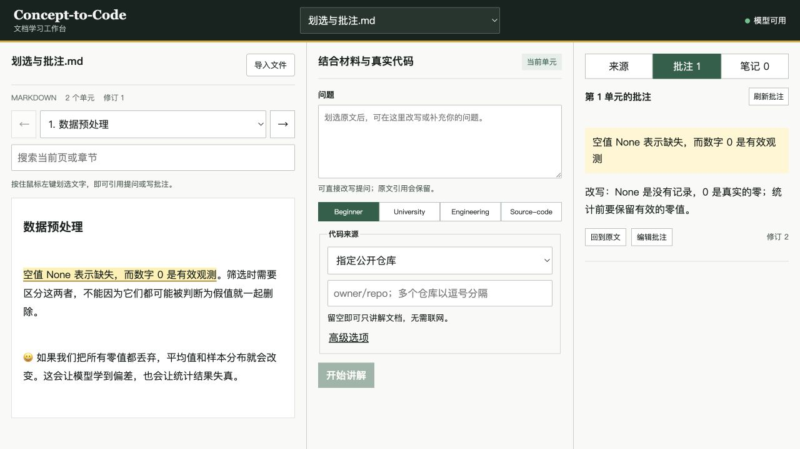

# 划选、引用提问与本地批注

2026-09-11 增量交付，承接完整产品候选。此功能已在独立测试数据中验证；最终人工验收和 main 合并仍由 Lead 决定。

## 使用方式

1. 导入材料后，按住鼠标左键划过需要理解的文字。松开后，原句会出现在对话框的「引用原文」区域。
2. 空白提问框自动填入「请解释这段原文……」。你可以直接改写、补充问题，再点「开始讲解」。如果已有自己写的问题，新的选区会保留它；点「带入问题」可以主动替换。
3. 想一次选整段时，移到段落上点击「选整段」。表格使用「选中表格」。
4. 点击选区旁的「添加批注」，或引用区的「写批注」，输入理解、疑问或自己的改写，然后保存。
5. 右侧「批注」显示当前页或章节的记录。保存的原文会高亮；点击高亮可编辑批注，「回到原文」可重新定位。刷新页面、重新打开文档后，已保存的批注仍在。

原文引用始终保留。改写问题或批注不会改动导入文件。划选和保存批注无需调用模型，只有点击「开始讲解」才请求 AI。未保存的批注在本次页面内翻页时仍保留，关闭或刷新前请先保存。

## PDF 与定位范围

PDF 原始页面现在有可选文字层，可直接用鼠标选字。提交前，程序会把选区映射到提取原文，并由服务端核对实际文字、版本和位置。

PDF 编码导致顺序歧义、重复文本无法唯一定位时，会提示改用下方提取文字，不自动猜测。扫描页仍需要 OCR，本增量不提供 OCR。已保存的 PDF 批注在下方提取文字中高亮，不写回 PDF 文件。

选区限 10,000 字符、50 个文本块；自动提问草稿对长引用做截短，完整引用仍单独保留。批注正文限 20,000 字符。界面适配窄屏，触摸设备可使用整段按钮；本轮实际手势验收针对鼠标，不代表真实触摸设备验收。

## 本地数据与兼容性

批注独立存入数据目录中的 `annotations-v1.sqlite3`。备份时保存整个数据目录，包括原文件副本、`learning-v1.sqlite3`、批注库和旧笔记库。旧笔记、旧 Schema/API 无迁移；改写批注只更新评论与修订号，冻结的原文锚点保持不变。

重复保存请求不会创建重复记录；旧修订更新会报告冲突并保留输入。删除须确认，迟到的旧保存不会恢复已删除批注。接口与新增五个 Schema 见 [INTERFACES](../../full-delivery/INTERFACES.md#本地原文批注2026-09-11-增量)。

## 验证结果

- 本地回归：373 项 Python、26 项前端测试通过；构建、Ruff、doctor、Schema/OpenAPI 一致性检查通过。
- 新增后端测试覆盖四格式引用、中文与 emoji、原文/哈希/版本不匹配、空选区、幂等、分页、修订冲突、删除确认、迟到重试和跨站请求拒绝。测试数据与个人资料隔离。
- 真实 Mac 浏览器：左键划选中文句子、跨段与 emoji、整段快捷选择、保留自定义问题、保存/编辑/刷新恢复批注、回到原文、PDF 原页选字及空白页均已检查。
- 使用现有本地 Qwen 模型完成一次「选句 → 改写问题 → 解释及改写回答」；这是实际模型调用，讲解内容仍需要读者判断。
- 桌面与 390 × 844 窄屏检查通过；窄屏点击高亮后批注输入框自动进入视野，页面无横向溢出。浏览器未记录警告或错误。
- 修复真实拖选中发现的竞态：高亮引起的浏览器选区变化不再触发新引用，点击其他控件不会把跨段引用缩短。已加入对应回归测试。

截图和检查日志的摘要见 [VERIFICATION.json](selection-annotations/VERIFICATION.json)。GitHub CI 对应的具体提交与运行链接在 PR 中记录；不以历史绿色检查替代当前候选验证。

